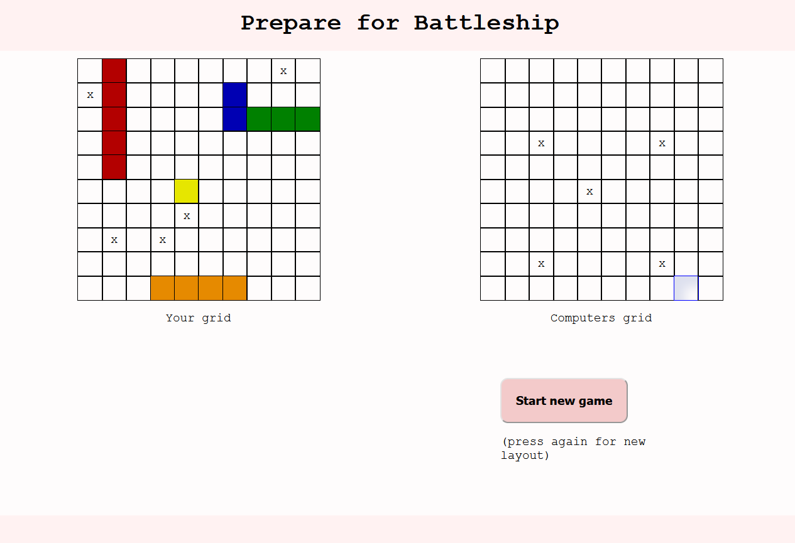

# Javascript Testing & BattleShip game

The testing-javascript folders contains tests of javascript code using Jest. The Battleship project is a continuation of this to practice test driven development. The project uses HTML, CSS and Javascript with ES6 modules and Webpack for bundling the modules.

## The Odin Project: Lesson Battleship

This project is build according to the specification of the [Battleship lesson](https://www.theodinproject.com/lessons/node-path-javascript-testing-practice)

## Live website

Access <a href="https://gohan61.github.io/testing-javascript/">Battleship game</a>

## Run locally

*In order to run project locally NodeJS + Git needs to installed on your system*

Follow these steps on Mac/Linux/WSL to run the project locally:

1. Open a terminal and go to a directory you want the repository to be in
2. Select Code in the Github project page and copy the SSH URL
3. git clone *SSH URL*
4. 'cd' into the repository you just cloned
5. 'cd' into battleship-project
6. Run 'npm run start' in a terminal
